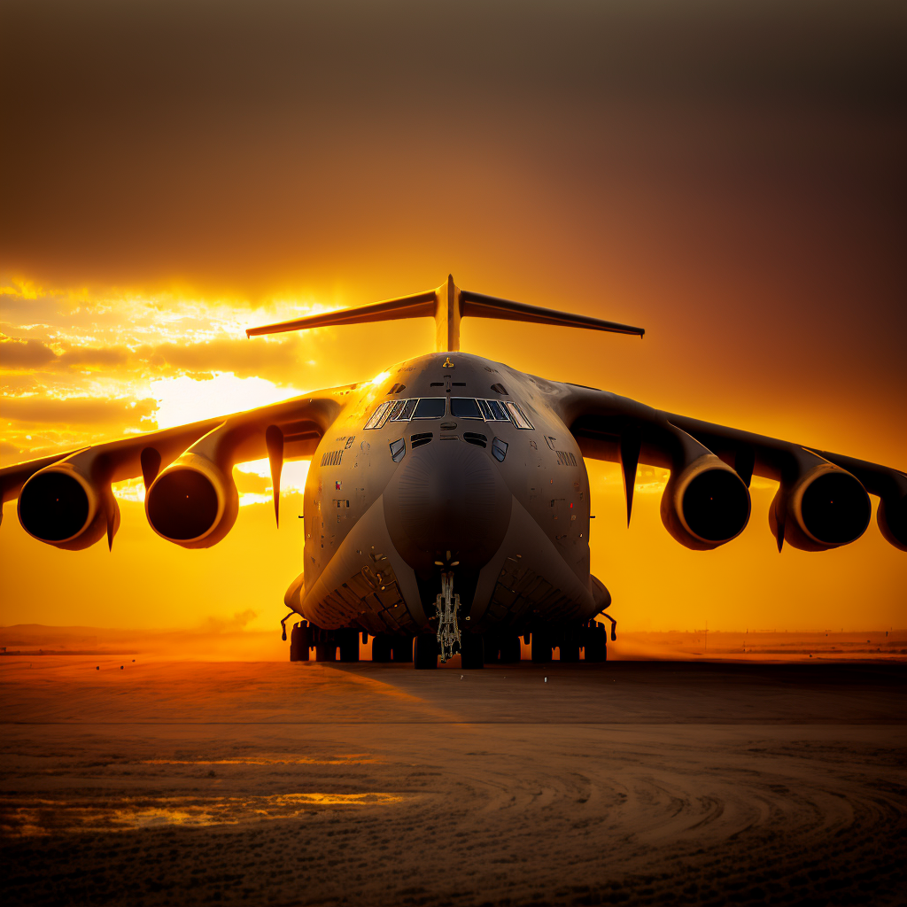

# Документация в авиационной отрасли и с чем её едят... 

***DISCLAIMER: Всё, что здесь написано, не является правдой и достоверной информацией! Это просто мой личный ларёк с шавермой на луне...*** 

## Сначала о бюрократии
**Три столпа бюрокритии в авиации:** 
- Межгосударственный авиационный комитет - МАК 
- Авиарегистр 
- Росавиация 

## Затем об основных документах
- Федеральный Авиационные Правила - ФАП (не счесть им числа)
